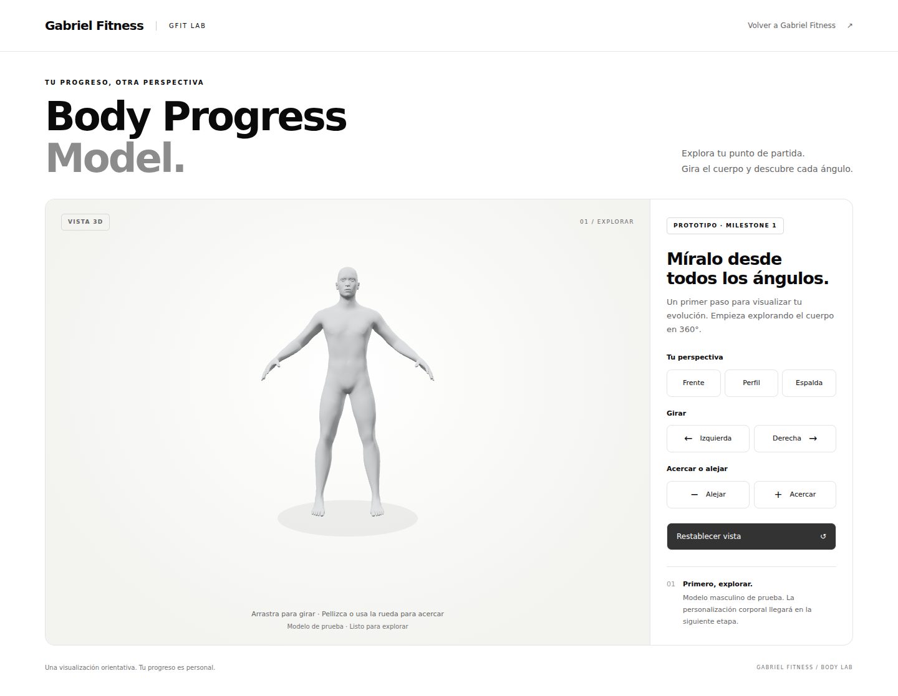
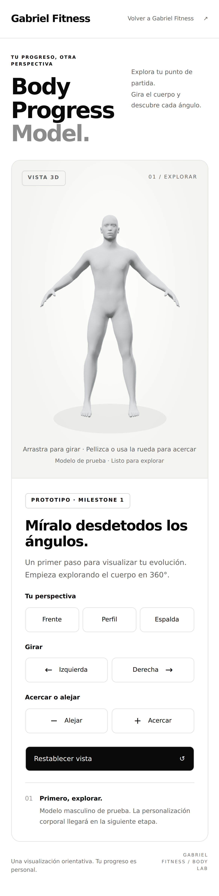

# GFIT 3D — Milestone 1

Estado: **implementado y validado en Chromium con WebGL de software**, 2026-09-23.
Rama: `gfit-3d-body-v1`. No publicado en producción.

## Probar la rama

Con Git y Python 3 instalados:

```sh
git clone --branch gfit-3d-body-v1 --single-branch https://github.com/gabrielfitness/gabriel-fitness-landing.git
cd gabriel-fitness-landing
python3 -m http.server 8000
```

Abrir **http://localhost:8000/modelo-3d.html**. El visor requiere HTTP; abrir el HTML con doble clic (`file://`) no es compatible con módulos/GLB.

Para probar en un teléfono real conectado a la misma Wi-Fi, abrir `http://IP-LOCAL-DEL-COMPUTADOR:8000/modelo-3d.html`. El servidor es de desarrollo; detenerlo con Ctrl+C después de probar.

Si el repositorio ya está clonado, guardar primero cualquier trabajo propio y usar la rama `gfit-3d-body-v1`; no cambiar a `main` para esta prueba.

## Qué funciona

- Cuerpo masculino real de MakeHuman, convertido a GLB; acabado neutro de maniquí.
- Giro 360° con ratón o un dedo; pellizco/rueda y botones para zoom limitado.
- Vistas frente, perfil y espalda, restablecer vista.
- Teclado: enfocar el visor, flechas para girar, +/− para zoom y Home para restablecer.
- Encuadre adaptable, resolución limitada a 1.5× para reducir carga gráfica.
- Renderizado solo al interactuar o redimensionar; sin bucle permanente ni animación automática.
- Carga/error/reintento; recuperación mediante recarga ante pérdida de contexto WebGL.
- Sin solicitudes a CDN, datos personales, analítica, cuentas ni cambios en landing/calculadora.

## Capturas del navegador

### Escritorio



### Móvil (390 px, emulación)



## Validación realizada

`tools/verify-3d.cjs` inicia un servidor local temporal y prueba el navegador. Requiere Playwright como dependencia de desarrollo externa; no añade dependencias a la web:

```sh
npm install --prefix /tmp/gfit-qa playwright
/tmp/gfit-qa/node_modules/.bin/playwright install chromium
NODE_PATH=/tmp/gfit-qa/node_modules node tools/verify-3d.cjs
```

Opcional: `CHROMIUM_EXECUTABLE=/ruta/a/chromium` para usar un binario existente. Las capturas se regeneran en `docs/`.

Resultados de esta entrega:

- Carga real de GLB, Three.js y WebGL sin errores de JavaScript ni HTTP en el visor; cero solicitudes externas.
- Comparación de píxeles confirma frente/perfil/espalda, giro completo de 360°, zoom y límites, restablecer, ratón y teclado.
- Arrastre táctil y pellizco enviados mediante eventos táctiles del navegador, con cambios confirmados en la imagen.
- 1440 px de escritorio; 390 px móvil con DPR 3; comprobaciones de desbordamiento a 320 y 768 px. DPR efectivo limitado a 1.5.
- Modelo ausente (404): aparece error y reintento funciona. Pérdida de contexto: error recuperable. WebGL no disponible: explicación visible.
- Menú móvil de landing y cálculo de calorías operativos. `index.html`, `styles.css`, `script.js`, `calculadora.html` e imágenes idénticos al commit inicial `05458d4`.
- Validador Khronos glTF: **0 errores, 0 advertencias**. GLB de 482,724 bytes; 13,380 vértices; 26,756 triángulos.
- La carga local rondó 0.2 segundos en el entorno de pruebas; **no es una medición de red móvil ni de GPU de un teléfono**.

Pendiente de comprobación física: Safari/iPhone y Android reales, memoria y fluidez bajo red/dispositivo de gama baja. La emulación confirma diseño y eventos; no sustituye estas pruebas.

## Alcance y siguiente paso

M1 valida exclusivamente el exterior visible y navegable. El modelo es provisional: faltan acabado final y, si se desea, ropa ajustada. No tiene rig ni morph targets embebidos todavía.

**M2 siguiente:** incorporar targets oficiales de peso/musculatura a la misma malla, probar extremos y combinaciones y exponer dos controles visuales. Los targets de peso son una aproximación artística, no porcentaje de grasa medido. Conservar `originalVertexIds` y triangulación al generar deltas.

M3 presets, M4 grupo muscular independiente, M5 hombre/mujer y M6 línea temporal siguen pendientes, en ese orden. No hay controles ficticios para funciones aún no implementadas.

## Para continuar con Work + GPT-6 Astra

Leer primero `PROJECT_CONTEXT.md` en esta rama y revisar los commits recientes. La landing usa su CSS/JS original; el visor solo usa `modelo-3d.css` y `modelo-3d.js`. `THIRD_PARTY_ASSETS.md` contiene licencias y procedencia. No cambiar IDs de vértices al incorporar morphs. No mergear ni desplegar sin autorización de Gabriel. Claude no participa en esta fase salvo autorización explícita posterior.
