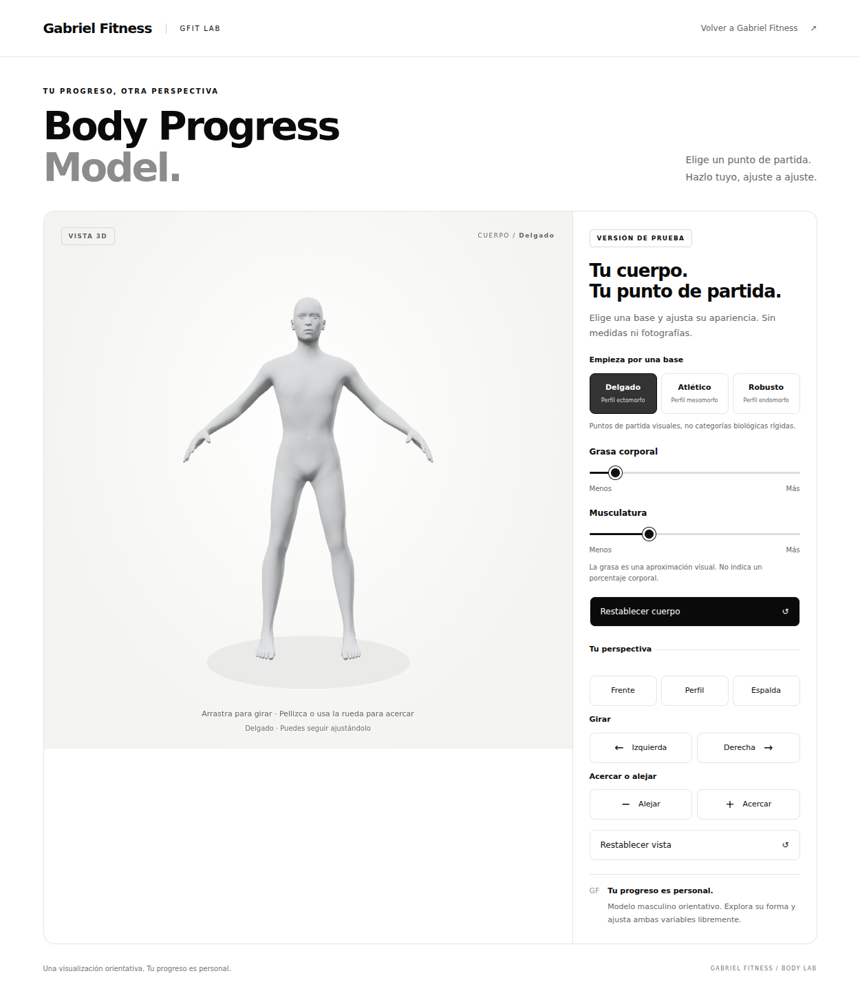
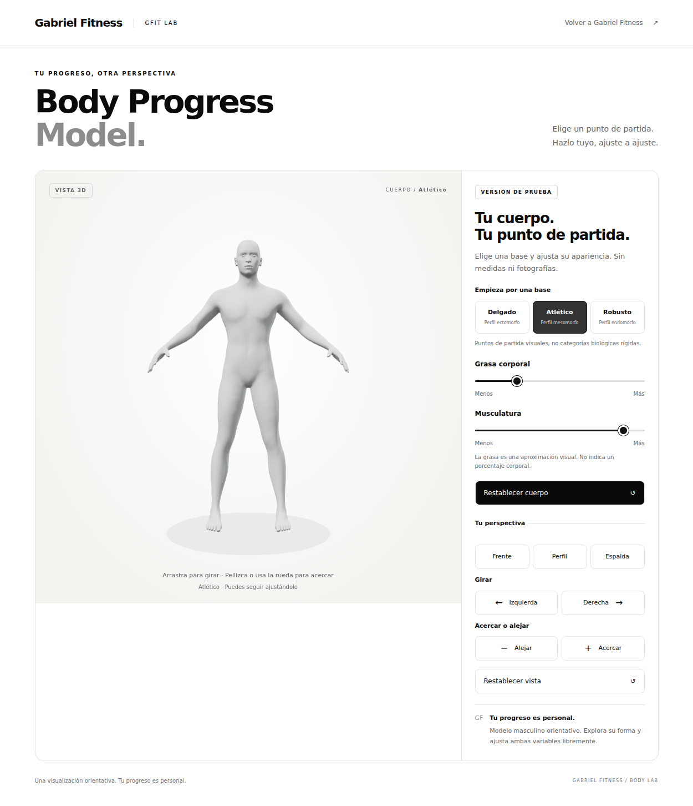
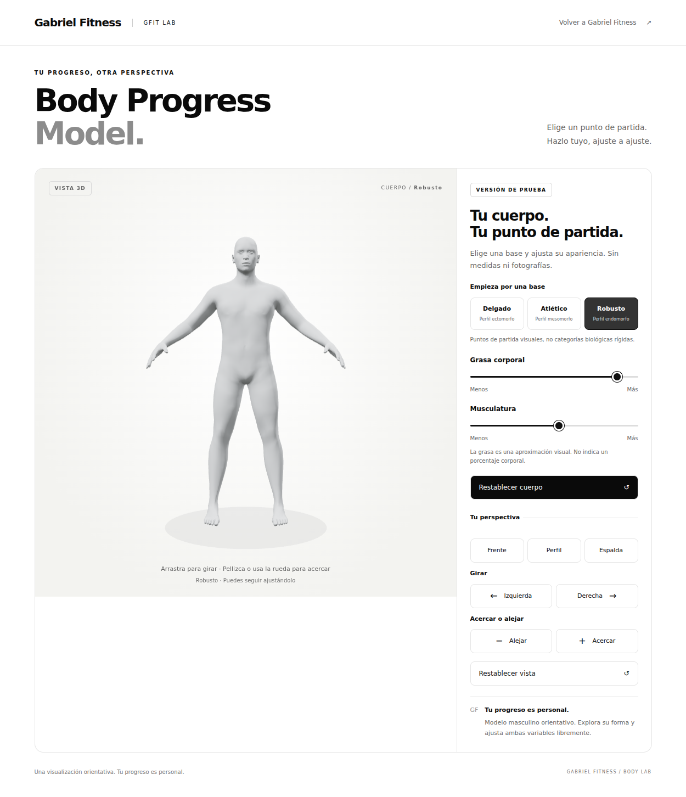
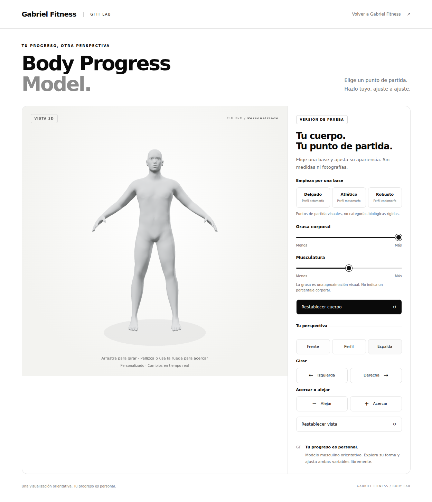
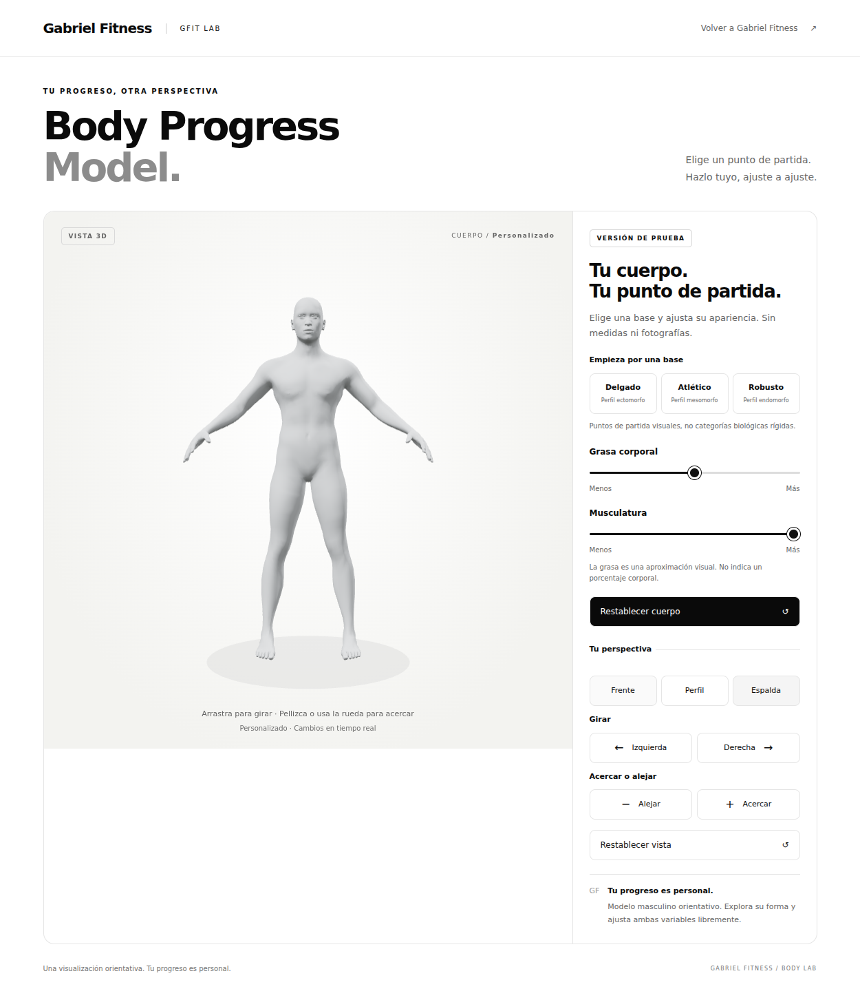
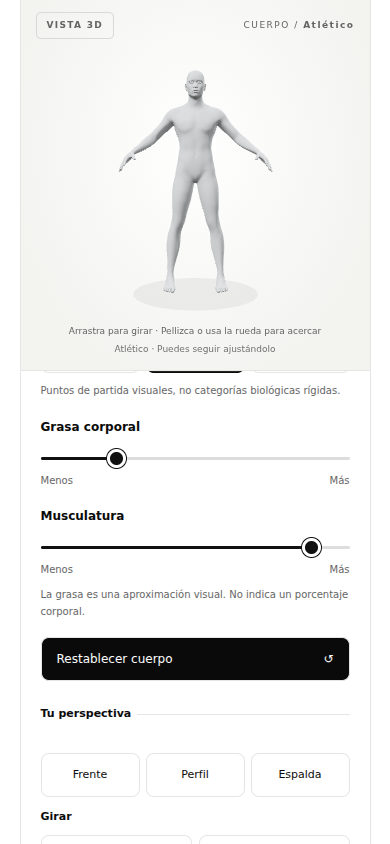

# GFIT 3D — Milestone 2 + demo básica de Milestone 3

**Completados y validados el 6 de octubre de 2026.** Desarrollo exclusivo de ChatGPT Work en `gfit-3d-body-v1`. No se modificó `main`, no se hizo merge ni despliegue a producción. M4 no iniciado; se espera la revisión de Gabriel.

## Probar la demo

**Opción sencilla en computadora:** descargar `GFIT-3D-Demo.html`, entregado junto con esta actualización, y abrirlo con doble clic en un navegador moderno con WebGL 2. Contiene el modelo, Three.js y la interfaz; funciona sin internet ni instalaciones. Si se abre como texto, usar «Abrir con» y elegir el navegador. Esta copia es una demo local, no una URL pública.

**Desde la rama, en computadora o teléfono:** con Git y Python 3 instalados, ejecutar en una carpeta nueva:

```sh
git clone --branch gfit-3d-body-v1 --single-branch https://github.com/gabrielfitness/gabriel-fitness-landing.git gfit-3d-prueba
cd gfit-3d-prueba
python3 -m http.server 8000
```

Abrir `http://localhost:8000/modelo-3d.html`. En un teléfono de la misma Wi-Fi, abrir `http://IP-LOCAL-DE-LA-COMPUTADORA:8000/modelo-3d.html`. Detener el servidor con Ctrl+C. En macOS se puede ver la IP en Ajustes del Sistema → Wi-Fi → Detalles → TCP/IP. La vista rápida de archivos de iOS puede no ejecutar HTML; para probar allí, utilizar el servidor local.

No se encontró una preview de rama verificable y no se modificó ninguna configuración de hosting para conseguirla. No hay URL pública de esta entrega.

## Qué funciona

- Modelo masculino completo, giro 360°, zoom limitado y vistas Frente / Perfil / Espalda.
- Grasa corporal y musculatura mediante deformación real de vértices, con respuesta inmediata.
- Delgado / Atlético / Robusto como puntos de partida editables; transición de 420 ms, cancelable al mover un slider. Respeta la preferencia de movimiento reducido.
- Restablecer cuerpo devuelve exactamente la malla neutral M1. Restablecer vista cambia solo la cámara.
- Ratón, teclado y gestos táctiles. En móvil el cuerpo permanece visible al desplazarse hacia los sliders.
- Sin cuentas, fotografías, medidas, datos enviados ni almacenamiento de información personal.

## Malla, targets y rangos

`models/body-male.glb` y su manifiesto original **no se modificaron**. `body-male-parametric.glb` copia byte por byte los buffers POSITION, NORMAL e índices de M1: 13,380 vértices, 26,756 triángulos y el mismo orden/IDs. Agrega ocho morph targets relativos de posición y normales; no utiliza escalado global.

Se utilizan las nueve combinaciones oficiales CC0 de MakeHuman:

`universal-male-young-{min|average|max}muscle-{min|average|max}weight.target`

La combinación average/average es el cuerpo base implícito. Las otras ocho se empaquetan como deltas respecto a él. Fuentes exactas, hashes SHA-256 y nombres en `models/body-male-parametric.source.json`; licencia y modificaciones en `THIRD_PARTY_ASSETS.md`.

`modelo-3d-morphs.js` aplica pesos bilineales no negativos sobre la cuadrícula conjunta 3×3. Como máximo contribuyen cuatro esquinas de la cuadrícula, incluyendo el neutral implícito. Se utilizan también los targets combinados de músculo/peso alto o bajo para conservar las proporciones diseñadas por MakeHuman. Las normales se interpolan junto con las posiciones.

Los sliders van de **0 a 100 unidades visuales**, equivalentes al rango MakeHuman **0.1–0.9**. El valor 50 corresponde a 0.5 y reproduce exactamente M1. Se limita el rango a una región interior del material original y no se extrapola. «Grasa» aproxima la apariencia mediante los targets de peso, **no representa un porcentaje de grasa corporal ni una medida clínica**.

| Preset | Grasa (parámetro MakeHuman) | Músculo (parámetro MakeHuman) |
| --- | ---: | ---: |
| Delgado | 0.18 | 0.32 |
| Atlético | 0.28 | 0.82 |
| Robusto | 0.82 | 0.52 |

Los términos ectomorfo/mesomorfo/endomorfo son referencias visuales secundarias. No clasifican biológicamente al usuario. Ajustar un slider conserva exactamente el otro parámetro, incluso tras un preset.

## Pruebas y resultados

**Geometría:** 121 combinaciones distribuidas por todo el rango, con detección BVH de cruces entre triángulos no adyacentes. Ninguna intersección nueva ni triángulo colapsado. Neutral idéntico a M1. Barridos de un paso por slider: desplazamiento máximo observado de un vértice ~1.90 mm por paso, sin saltos. Khronos glTF Validator: **0 errores y 0 advertencias**. Reporte: [milestone-2-geometry.json](milestone-2-geometry.json).

**Revisión visual:** estados neutral; grasa mínima/media/máxima; músculo mínimo/medio/máximo; alto/alto, bajo/alto, alto/bajo y bajo/bajo; tres presets. Inspeccionados frente, perfil y espalda, con atención a abdomen, cintura, pecho, hombros, brazos, glúteos, muslos, cuello y articulaciones. No se observaron roturas corporales visibles dentro del rango expuesto.

**Navegador:** carga real, ocho morphs presentes, cambios en las posiciones de vértices en las nueve combinaciones mínimo/medio/máximo; escala siempre 1; presets y fotogramas intermedios, cancelación por edición manual, independencia de controles, reset exacto, giro 360°, vistas, zoom/límite, arrastre, teclado, tap en slider móvil, pellizco, responsive 320/390/768/1440, movimiento reducido, ausencia de bucle de render en reposo, error 404/reintento, falta de WebGL y pérdida de contexto. Sin errores JS ni HTTP en el visor durante el uso normal; cero peticiones externas. Reporte: [milestone-2-browser.json](milestone-2-browser.json).

**Regresión:** los archivos originales de landing, calculadora e imágenes son idénticos al inicio de esta ejecución. Menú móvil y cálculo de calorías probados.

**Demo descargable:** abierta desde `file://` en Chromium con red desactivada; modelo, presets, sliders, cambio de vista, zoom y retorno neutral operativos, sin errores JS ni solicitudes HTTP.

## Rendimiento y limitaciones

- GLB: 3,056,784 bytes sin compresión HTTP. La demo autocontenida completa pesa ~4.9 MB.
- Actualización de ocho pesos; deformación en GPU; sin recalcular toda la malla en CPU por movimiento.
- DPR limitado a 1.5. Render bajo demanda; bucle temporal solo durante la transición de presets.
- Carga local observada ~0.2–0.3 s. Manejador de slider + envío de render ~0.3 ms mediano / ~0.4 ms p95 en la prueba inicial. El reporte contiene los valores de la última ejecución. **Son mediciones locales de Chromium con WebGL de software, no FPS ni tiempos de GPU móvil real.**
- Falta comprobar Safari/iPhone y Android físicos, memoria y fluidez en dispositivos modestos.
- Se detectaron **ocho pares de contacto internos en la boca ya presentes en M1**. Se mantienen para conservar el neutral exacto. No son cruces nuevos causados por los morphs, pero no debe describirse la malla como anatómicamente certificada o totalmente libre de intersecciones. Una corrección de boca sería un ajuste separado del modelo base.
- El muestreo de 121 estados y la revisión visual no son una prueba matemática de todas las combinaciones reales posibles. La figura es un maniquí orientativo sin ropa/rig, no un gemelo digital del cliente.

## Capturas

| Delgado | Atlético | Robusto |
| --- | --- | --- |
|  |  |  |

| Grasa alta | Musculatura alta | Móvil |
| --- | --- | --- |
|  |  |  |

## Reproducir las pruebas o exportar

Dependencias solo para desarrollo, fuera de la web:

```sh
npm install --prefix /tmp/gfit-qa playwright three@0.180.0 three-mesh-bvh gltf-validator esbuild
/tmp/gfit-qa/node_modules/.bin/playwright install chromium
NODE_PATH=/tmp/gfit-qa/node_modules node tools/verify-geometry.cjs
NODE_PATH=/tmp/gfit-qa/node_modules node tools/verify-3d.cjs
NODE_PATH=/tmp/gfit-qa/node_modules node tools/export-demo.cjs /tmp/GFIT-3D-Demo.html
```

También se admite `CHROMIUM_EXECUTABLE=/ruta/a/chromium`. El empaquetador de demo usa exactamente los JS/CSS/GLB del proyecto y conserva los avisos legales; no reemplaza la arquitectura estática de la rama ni añade un build obligatorio.

## Siguiente paso

Gabriel revisa esta demo. Después, con su autorización, M4: un grupo muscular independiente sobre la misma topología, con validación de combinaciones y límites. No se ha implementado M4 ni mujer, meses, cuentas, fotos, mediciones o anatomía interna.
